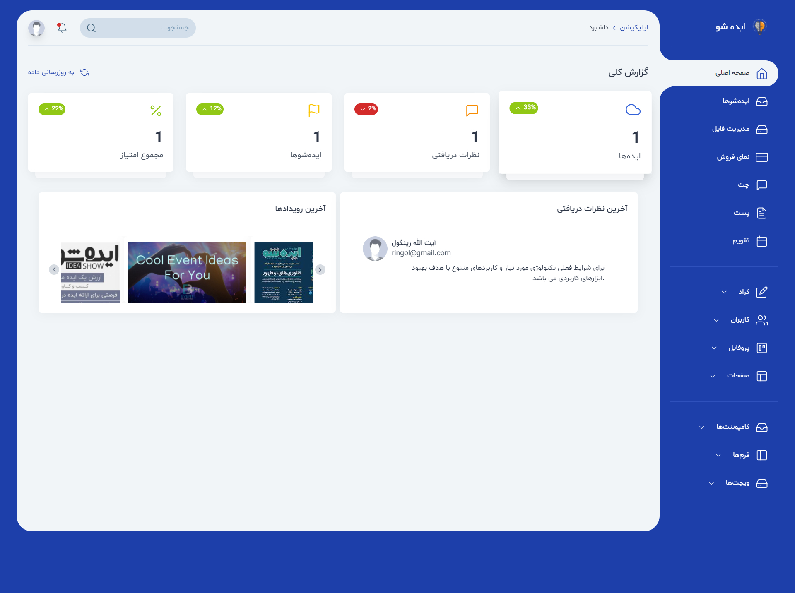
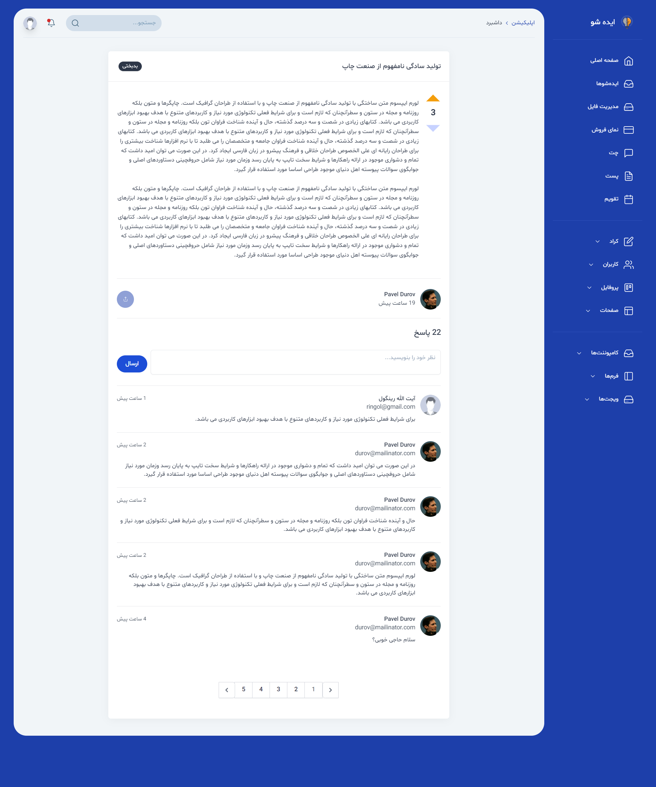
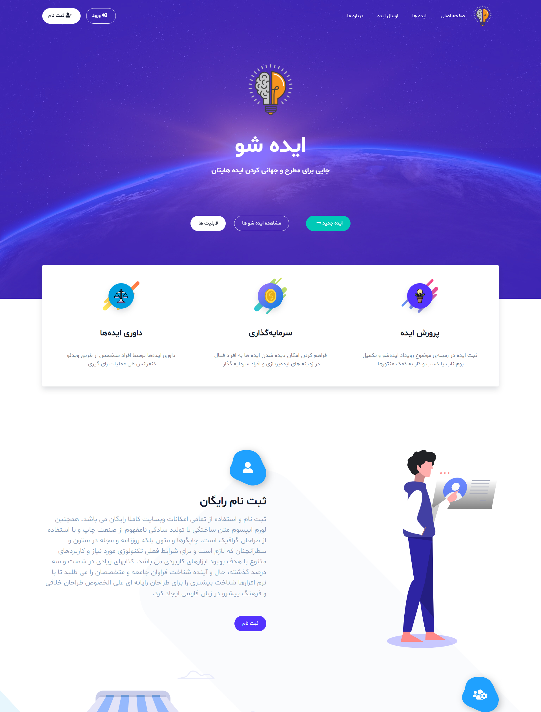

# Laravel IdeaShow

**IdeaShow** is a Laravel-based platform designed for community interaction, allowing users to submit ideas, comment, evaluate, and discuss proposals in a structured environment. The application supports user-centric interaction with features such as idea submission, threaded commenting, and voting, all within a modern and responsive interface.

---

## Features

- User registration and simple authentication
- Idea submission and display functions
- Commenting system with reply support
- Voting or rating system for ideas
- Clean frontend design supporting interactivity and responsiveness
- Blade-based templates with dynamic JavaScript enhancements

---

## Technology Stack

- **Backend**: Laravel (PHP) with Blade templating
- **Frontend**: JavaScript and SCSS/CSS
- **Styling**: SCSS for modular and maintainable styles
- **Architecture**: MVC design using Laravel conventions

---

## Screenshots

### Admin Dashboard – Idea Overview and Metrics  


### Idea Detail Page – Comments and Interactions  


### Homepage – Feature Highlight and Navigation  


---

## Installation

To get started with IdeaShow locally:

```bash
git clone https://github.com/M0BiN/laravel-ideashow.git
cd laravel-ideashow
composer install
npm install && npm run dev
cp .env.example .env
php artisan key:generate
php artisan migrate
php artisan serve
```
